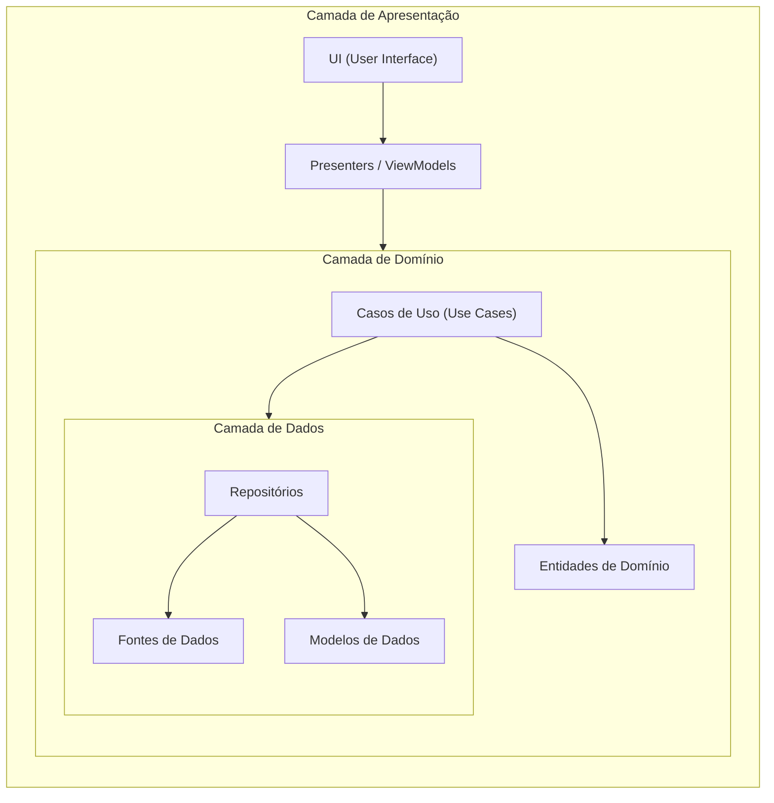

# Análise Arquitetural - MyFood Refactor

## Arquitetura Identificada

O projeto MyFood Refactor utiliza uma arquitetura baseada em camadas (Layered Architecture) com elementos de arquitetura limpa (Clean Architecture). A organização do código segue uma estrutura modular, separando as diferentes responsabilidades do sistema.

## Mapeamento das Camadas

## Análise dos Pontos Críticos

### 1. Separação de Responsabilidades
✅ O projeto respeita a separação de responsabilidades através da organização modular por funcionalidades. Cada feature está isolada em seu próprio diretório, facilitando a manutenção e reutilização.

### 2. Flexibilidade de Interface
✅ É relativamente fácil trocar a interface, pois a lógica de negócio está separada da apresentação. Os componentes são reutilizáveis e não estão acoplados diretamente à lógica de negócio.

### 3. Acoplamento e Coesão
✅ Os módulos têm baixo acoplamento e alta coesão:
- Cada feature está isolada em seu próprio diretório
- Componentes são reutilizáveis
- Lógica de negócio não está acoplada à UI

### 4. Dependências Invertidas
✅ Existe uma dependência invertida implícita:
- A lógica de domínio não depende de tecnologias específicas
- As interfaces são definidas no domínio e implementadas nas camadas externas
- Os repositórios abstratos são definidos no domínio

### 5. Sugestões de Melhorias

1. **Implementar Repositórios**: Criar interfaces de repositório na camada de domínio para melhorar a testabilidade e flexibilidade.
2. **Adicionar Serviços de Domínio**: Criar serviços específicos para cada feature que encapsule a lógica de negócio complexa.
3. **Implementar DTOs**: Usar Data Transfer Objects para transferir dados entre as camadas, melhorando a separação de responsabilidades.
4. **Adicionar Validações**: Implementar validações mais robustas usando classes de validação específicas.
5. **Melhorar Tipagem**: Aumentar o uso de TypeScript para melhorar a segurança do código e facilitar o desenvolvimento.

## Conclusão
O projeto segue uma arquitetura limpa e organizada, com uma boa separação de responsabilidades. A estrutura modular facilita a manutenção e evolução do sistema. As sugestões de melhorias visam tornar a arquitetura ainda mais robusta e segura, seguindo os princípios do Clean Architecture.
